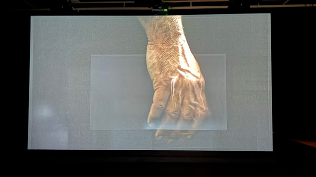
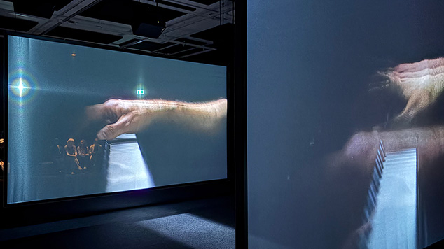

<h1>Art comptemporain</h1>

  
  <i> Vue de l'oeuvre - 04/04/2025 - prise par Delphine Gagnon </i>

<h2>Informtations</h2>

Nous avons visité cette exposition le vendredi 4 avril 2025. C'était une expostion permanente à Montréal.

<h2>Ravel Ravel Interval</h2>

Crée par Anri Sala en 2017

  
  <i> Vue de l'oeuvre - 04/04/2025 - prise par Stanley Olivier Vital </i>

Ravel Ravel Interval est une exposition dans une grande sale avec deux projecteurs qui projete une vidéo d'une main qui joue du piano seul. Les 2 projecteurs sont 
