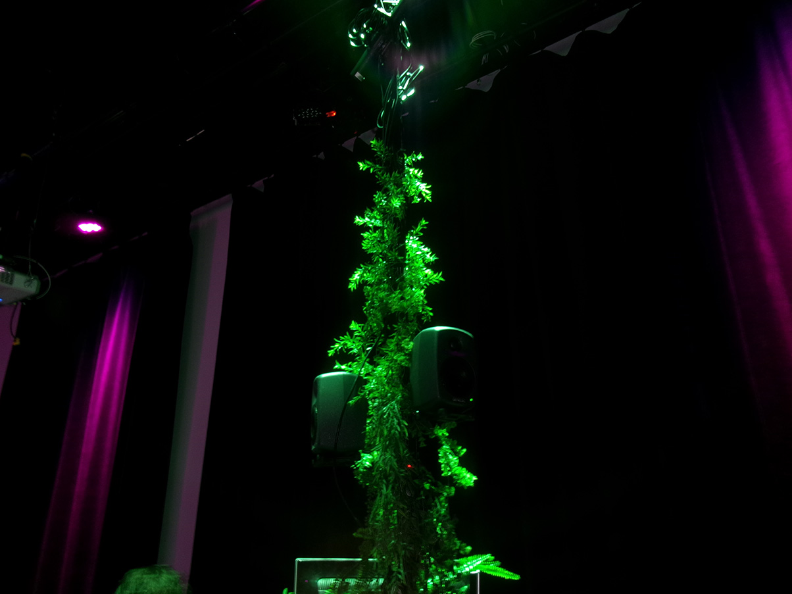
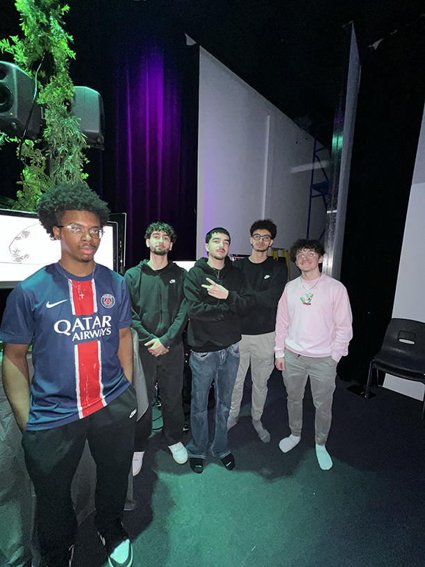

<h1> Exposition du projet étudiant Fuga <h1/>

  
  <i> Vue de l'oeuvre - 18/03/2025 - prise par Olivier Leconte Leclerc </i>

<h2> Informations </h2>

Cette visite a duré du 18 au 21 mars au grand studio du collège montmorency. C’était une exposition temporaire et intérieure.

<h2>Fuga</h2>
Crée par
Abdel Ali Djeral
Daniel Dezemma
Matis Labelle
Tristan Khadka
Yavuz-Selim Gucluer  
Réalisé en 2025

  
  <i> Vue de l'équipe - 18/03/2025 - prise par Pablo Pereira</i>

<h2>Description</h2>

Fuga est un générateur d'arbre qui est totalement fascinant. 3 écran sont suspendu du plafond et sur ces écrans on voit des abres qui prennent forme de façon différente pour chaque personnes qui fait des sons différents avec les mannettes et des haut-parleurs.

<h2>Mise en espace</h2>

  
  <i> Vue de l'équipe - 18/03/2025 - prise par Pablo Pereira</i>

