<h1> Exposition des projets finissants - Resonance - </h1> 

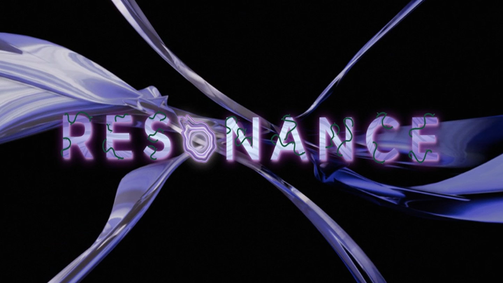
*Logo de résonance - capture d'écran*

<h2> Expositions </h2>
1. CON DU8  
2. Internature  
3. Fuga  
4. Fuga  
5. Prismatica  
6. Luminaturia  
7. Arcadia  

---
<h2> Informations </h2>

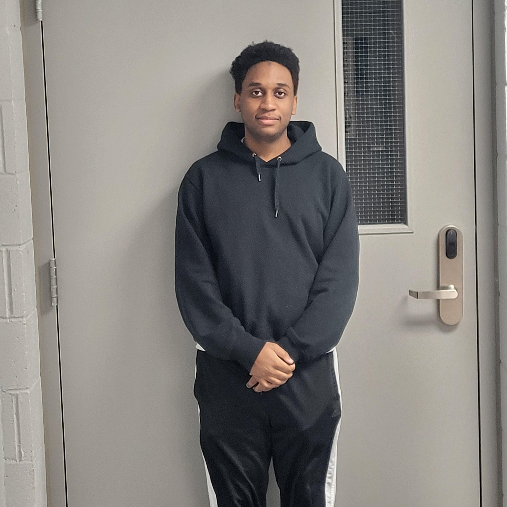
*Stanley 19/03/2025 - Olivier Leclerc Leconte*

Cette visite a duré du 18 au 21 mars au grand studio du collège montmorency. C’était une exposition temporaire et intérieure.

<h2> C0n-Du8 </h2>

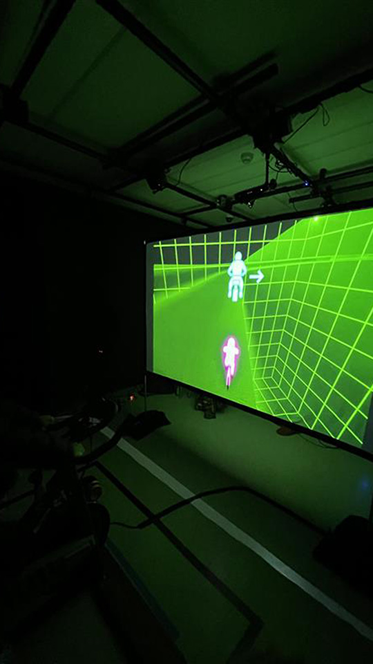  
  <i> Vue de l'oeuvre - 18/03/2025 - prise par Pablo Pereira</i>

<h3> Installation </h3>

Réalisé par: 
Alexandre Gervais
Ian Corbin
Jérémy Roy-Coté
Keven Malric
Samuel Desmeules-Voyer  
Présenté en 2025

<h3> Description </h3>

Le condu8 est une oeuvre constituée d'un vélo stationnaire, un projecteur des hauts-parleurs et des senseurs. Un joueur entre dans la zone du vélo, monte dessus et tente de gagner la course contre les autres adversaires.  

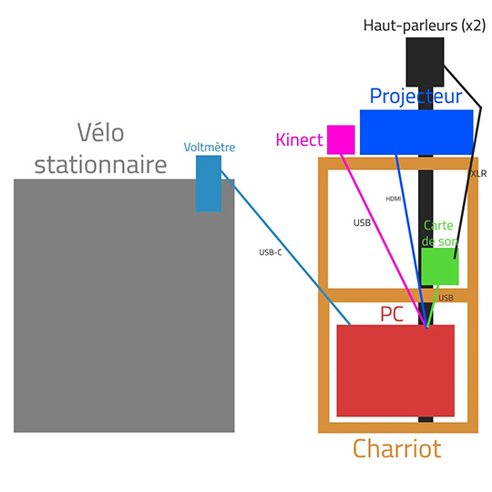  
  <i> Plantation donnée par les membres de l'équipe</i>

 

<h3> Mon opinion </h3>

Mon expérience avec le Con-Du8 était très positive, c'était mon oeuvre préférée. J'ai essayé de compléter le jeu du premier coup, mais lorsque j'ai fini ce qui me semblait être le jeu en entier, je n'avais réussi qu'un niveau. Après avoir réalisé ma défaite, j'ai aimé l'oeuvre encore plus, parce que j'ai vraiment pu sentir que le but de cette expérience est de se pousser au dela de ses limites tout en s'amusant et ils accomplissent cet objectif haut la main.

[Github de l'équipe](https://gearshift-games.github.io/Web-C0N-DU8/#/)

<h2> Internature </h2> 

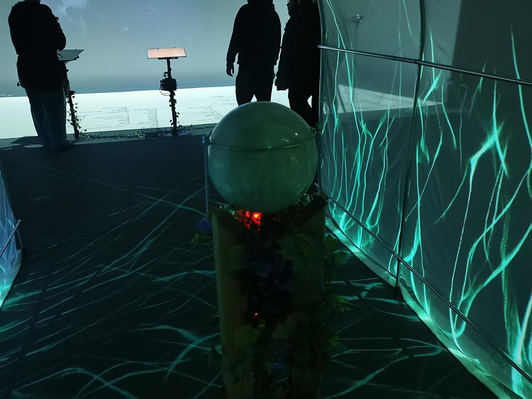  
  <i> Vue de l'oeuvre - 19/03/2025 - prise par Stanley Olivier Vital</i>

<h3> Installation </h3>

Réalisé par: 
Kenza El Harrif
Isaac Fafard
Delphine Grenier
Khaly Tia Sing
Sitmonternna Yi  
Présenté en 2025

<h3> Description </h3>

Internature est une oeuvre consituée d'haut parleurs pour le son d'ambiance, d'une sphère a l'intérieur d'une petite serre qui fait pousser plusieurs plantes virtuelles après chaque mouvement de la sphère à l'aide de projecteurs aux alentours de la serre.  

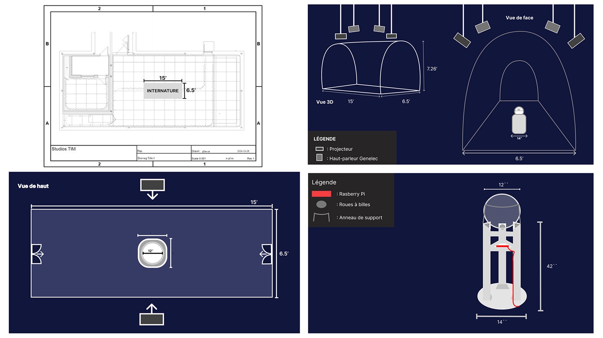  
  <i> Plantations donnée par les membres de l'équipe</i>

 

<h3> Mon opinion </h3>

Internature était une merveilleuse expérience que je recomanderai à n'importe qui. Ma partie préférée de cette oeuvre était le son, parce qu'il aidait vraiment à mettre dans l'ambience et m'emmener dans leur monde. Ces sons mélangés avec les magnifiques effets visuels ont aidé à faire de cette oeuvre une expérience marquante.

[Github de l'équipe](https://tprangers.github.io/internature/#/)

<h2> Fuga </h2> 

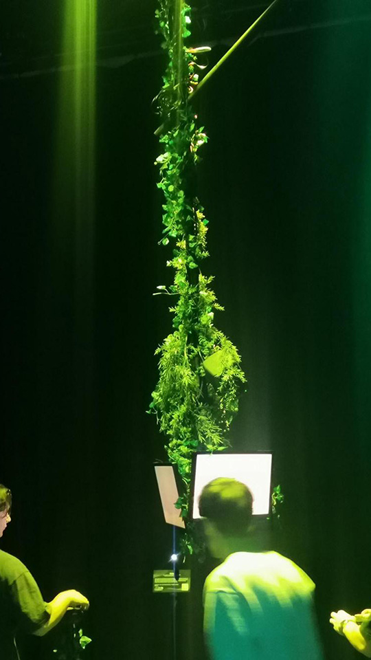  
  <i> Vue de l'oeuvre - 18/03/2025 - prise par Olivier Leconte Leclerc</i>

<h3> Installation </h3>

Réalisé par: 
Abdel Ali Djeral
Daniel Dezemma
Matis Labelle
Tristan Khadka
Yavuz-Selim Gucluer

<h3> Description </h3>

Fuga est un générateur d'arbre qui est totalement fascinant. 3 écran sont suspendu du plafond et sur ces écrans ont voit des abres qui prennent forme de façon différente pour chaque personnes qui fait des sons différents avec les mannettes et des haut-parleurs. 

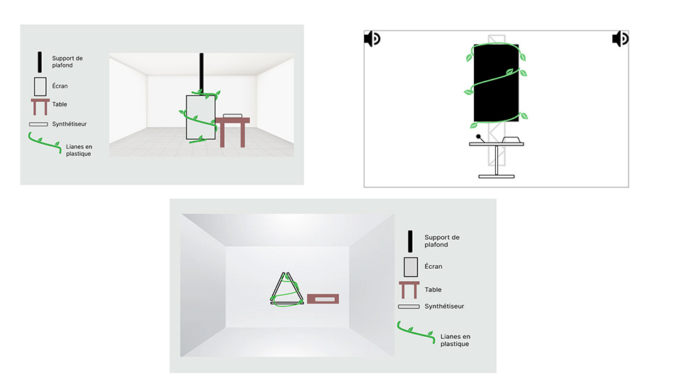  
  <i> Plantations donnée par les membres de l'équipe</i>

 

<h3> Mon opinion </h3>

Fuga m'a beaucoup plu, le son qui sortait des haut parleurs était très calme et harmonieux et ça correspondait à l'ambiance des arbres et la nature. Mon point préféré de l'oeuvre est le fait qu'il y a une possibilité infinie d'arbre différent qui peuvent être crée.

[Github de l'équipe](https://escapism-fuga.github.io/Fuga/#/)

<h2> Etheria </h2> 

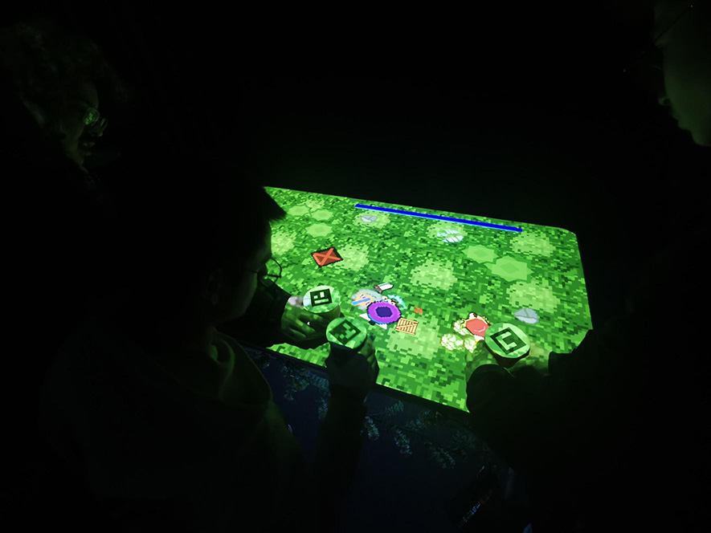  
  <i> Vue de l'oeuvre - 19/03/2025 - prise par Stanley Olivier Vital</i>

<h3> Installation </h3>

Réalisé par: 
Joshua Gonzalez-Barrera
Maik Hamel
Michael Un Dupré
Pierre-Luc Proulx
Victor Gileau  
Présenté en 2025

<h3> Description </h3>

Etheria est un jeu vidéo qui utilise des sortes de "pions" pour intéragir avec l'environment du jeu. Le jeu est visible grâce à un projecteur qui projete l'image sur sur une table.   

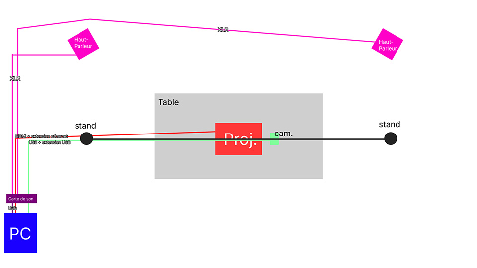  
  <i> Plantation donnée par les membres de l'équipe</i>

 

<h3> Mon opinion </h3>

J'ai beaucoup aprécier mon expérience avec Etheria, parce que c'était un jeu relativement simple a comprendre et pouvoir le tester avec des amis c'était réelement un moment incroyable.

[Github de l'équipe](https://ethereal-creators.github.io/Etheria/#/)

<h2> Prismatica </h2> 

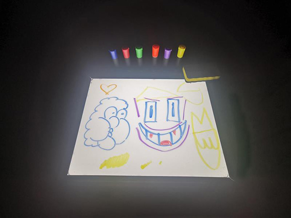  
  <i> Vue de l'oeuvre - 18/03/2025 - prise par Olivier Leconte Leclerc</i>

<h3> Installation </h3>

Réalisé par: 
Ikrame Rata
Jérémy Duverseau
Vincent Delisle  
Présenté en 2025

<h3> Description </h3>

Prismatica est une oeuvre ou on dessine avec un marquer de couleur dur un petit tableau blanc. Le dessin que nous faisons sera ensuite afficher sur un écran grâce au capteur en haut du tableau. En même temps de nous afficher notre dessin on l'entend également avec les écouteurs.  

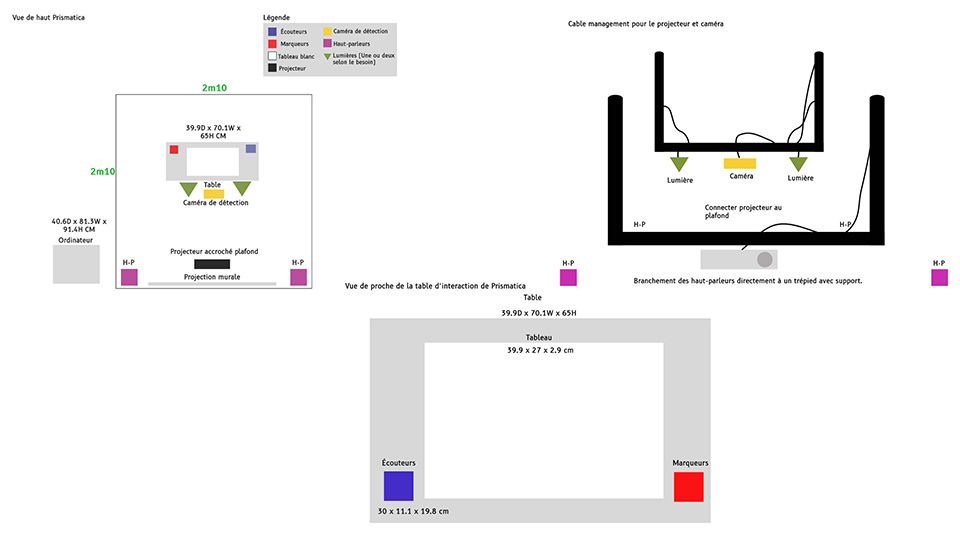  
  <i> Plantations donnée par les membres de l'équipe</i>

 

<h3> Mon opinion </h3>

Prismatica était une expérience très plaisante. J'ai beaucoup aimé le fait que comparé aux autres projets, il vient chercher plus de créativité de la part de l'utilisateur.

[Github de l'équipe](https://pootpookies.github.io/Prismatica/#/)

<h2> Luminatura </h2> 

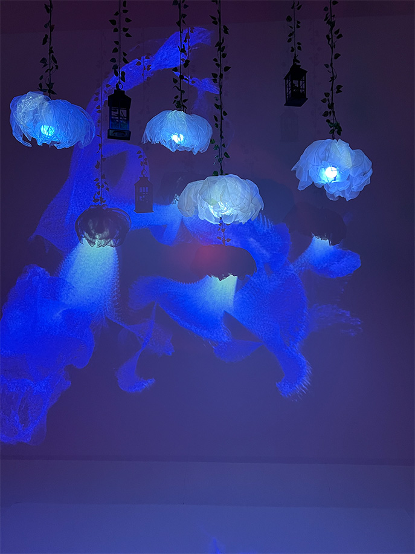  
  <i> Vue de l'oeuvre - 18/03/2025 - prise par Pablo Pereira</i>

<h3> Installation </h3>

Réalisé par: 
Audrey Dandurand
Camilia Bouatmani
Ihab Mouhajer
Justine Rousseau
Prethiah Rajaratnam  
Présenté en 2025

<h3> Description </h3>

Luminatura est une oeuvre composée d'une plaque de métal qui crée des effets de lumière ou autre sur le mur lorsqu'on la touche avec des sons naturels qui sortent des haut-parleurs.  

  
  <i> Plantation donnée par les membres de l'équipe</i>

 

<h3> Mon opinion </h3>

Mon expérience avec le Con-Du8 était très positive, c'était mon oeuvre préférée. J'ai essayé de compléter le jeu du premier coup, mais lorsque j'ai fini ce qui me semblait être le jeu en entier, je n'avais réussi qu'un niveau. Après avoir réalisé ma défaite, j'ai aimé l'oeuvre encore plus, parce que j'ai vraiment pu sentir que le but de cette expérience est de se pousser au dela de ses limites tout en s'amusant et ils accomplissent cet objectif haut la main.

[Github de l'équipe](https://miaou-mafia.github.io/projet-luminatura/#/)

<h2> Arcadia </h2> 
