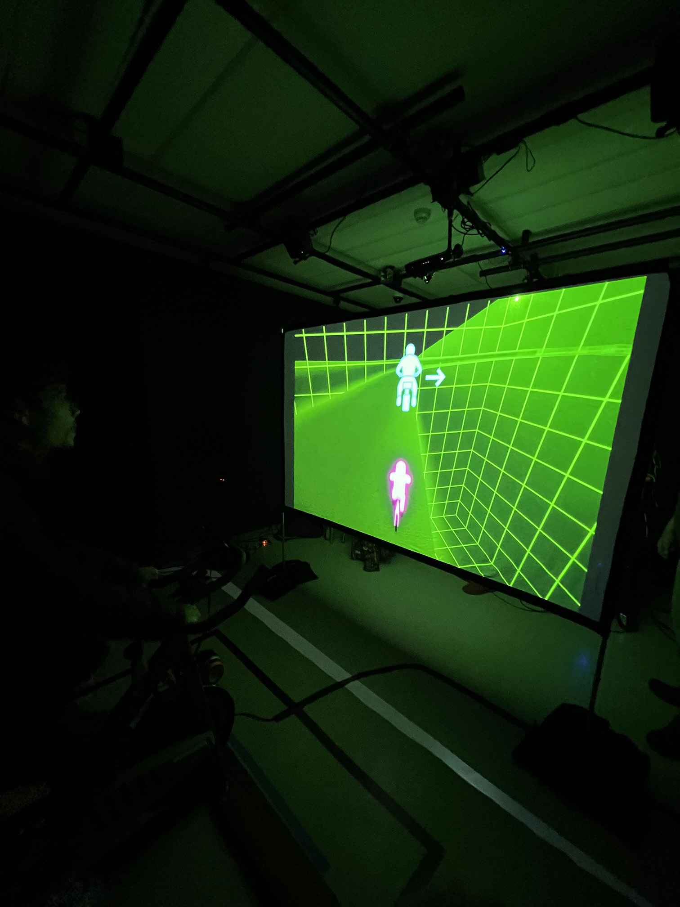

<h1> Exposition des projets finissants - Resonance - </h1> 

*Logo de résonance - capture d'écran*

<h2> Expositions </h2>
1. CON DU8  
2. Internature  
3. Etheria  
4. Fuga  
5. Prismatica  
6. Luminaturia  
7. Arcadia  

---
<h2> Informations </h2>

*Stanley 19/03/2025 - Olivier Leclerc Leconte*

Cette visite à duré du 18 au 21 mars au grand studio du collège montmorency. C’était une exposition temporaire et intérieure.

<h2> C0n-Du8 </h2>

Cette exposition 

<h2> Internature </h2> 

<h2> Etheria </h2> 

<h2> Fuga </h2> 

<h2> Prismatica </h2> 

<h2> Luminaturia </h2> 

<h2> Arcadia </h2> 
