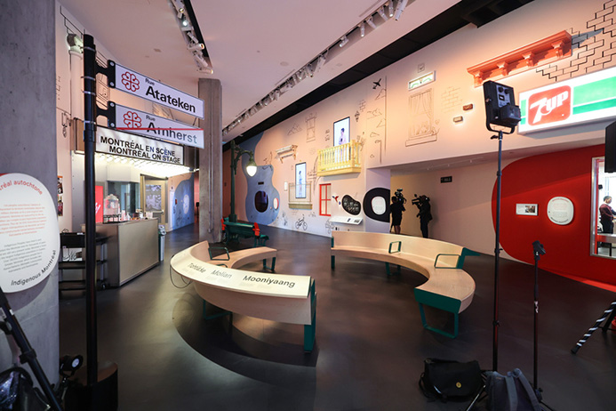
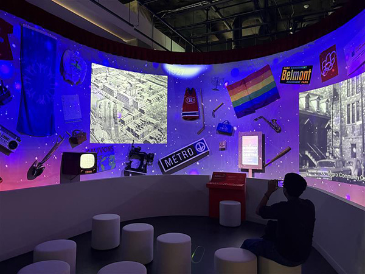
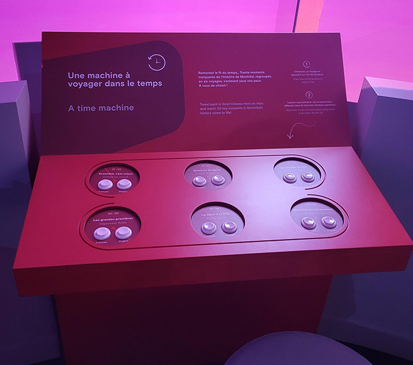

<h1>Centre des mémoires montréalaises </h1>

  
  <i> L'entrée du centre des mémoires montréalaises - 22/04/2025 - photo prise par La Presse </i>

<h2>Informations</h2>

<h2>Machine à remonter dans le temps</h2>

Crée par le centre des mémoires montréalaises en juillet 2024

  
  <i> Vue du dispositif de la machine a remonter dans le temps - 22/04/2025 - prise par Delphone Gagnon </i>

<i>La machine à remonter dans le temps</i> est un dispositif dans une grande salle avec plusieurs projecteurs qui projettent un fond sur un mur blanc. Sur ce même mur blanc plusieurs objets représantant la culture québecoise étant placé de manière aléatoire. Deux projecteurs projettent une vidéo précise sur le sujet choisi.

  
  <i> La table de choix d'époque- 22/04/2025 - prise par Stanley Olivier Vital </i>

Une table rouge avec des bouttons est située devant le mur et chaque bouttons mène a une vidéo explicative différente.

  
  <i> La table de choix d'époque- 22/04/2025 - prise par Stanley Olivier Vital </i>

Derriere la table rouge au centre du mur, il y avait une pancarte qui changeais dépendement de quelle époque de la présentation vous écoutiez.

  
  <i> Vue de l'oeuvre - 22/04/2025 - prise par Stanley Olivier Vital </i>

<h2>Appréciation</h2>

Depuis que je suis jeune, j'adore la musique et j'ai pris des cours de piano, donc le sujet m'a particulièrement touché. Selon moi, l'idée est très bien pensée : la manière d'illustrer le pianiste qui ne pouvait pas jouer parfaitement sa pièce à cause de son amputation était ingénieuse.
