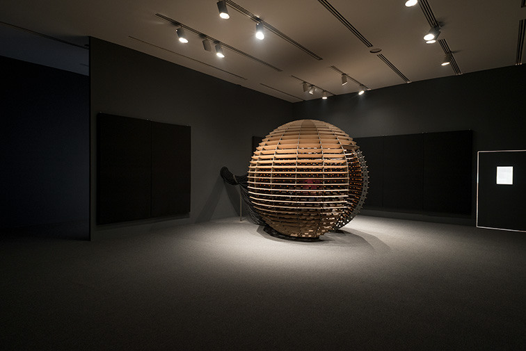

<h1> Conférence  </h1>

<h2>Introduction</h2>

Le mardi 25 mars 2025, j'ai eu la chance d'assister à une conférence sur deux œuvres présentées par Jade Séguela, la registraire du studio Antimodular de Rafael Lozano. Deux œuvres nous ont été présentées cette journée-là. Dans l'ordre, la registraire nous a présenté <i> Sphere Packing: Bach </i> , suivi de <i>Shadow Tuner</i>.

<h2>Développement</h2>

<h3><i> Sphere Packing: Bach </i></h3>

  
  <i> Photo de l'oeuvre Sphere Packing Bach - 2019 - prise par Roberto Ortiz </i>

<i> Sphere Packing: Bach </i> est une sphère avec un trou à l'intérieur qui permet aux visiteurs d’y entrer. Cette sphère a été créée avec de l'aluminium, du bois et un grand nombre de haut-parleurs. L'œuvre consiste à illustrer l'ampleur de la discographie de Johann Sebastian Bach. Les haut-parleurs jouent toutes les compositions, les unes après les autres, sans arrêter la musique précédente. Au climax de l'expérience, toutes les musiques de Bach jouent en même temps, créant une cacophonie totale. Les haut-parleurs sont tous connectés avec des fils, et la taille de cette œuvre fait en sorte que 11 kilomètres de câbles sont nécessaires pour alimenter la sphère.

<h3><i>Shadow Tuner</i></h3>

