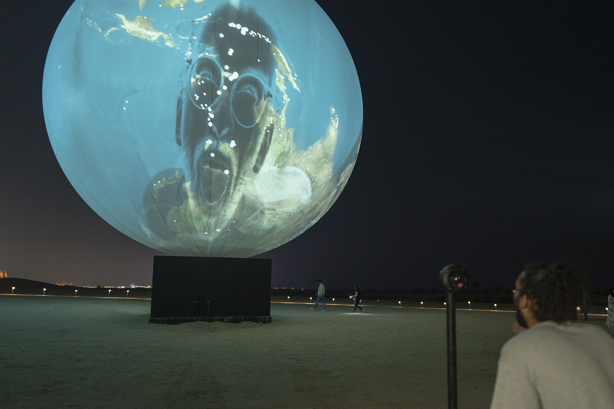

<h1> Conférence  </h1>

<h2>Introduction</h2>

Le mardi 25 mars 2025, j'ai eu la chance d'assister à une conférence sur deux œuvres présentées par Jade Séguela, la registraire du studio Antimodular de Rafael Lozano. Deux œuvres nous ont été présentées cette journée-là. Dans l'ordre, la registraire nous a présenté <i> Sphere Packing: Bach </i> , suivi de <i>Shadow Tuner</i>.

<h2>Développement</h2>

<h3><i> Sphere Packing: Bach </i></h3>

  
  <i> Photo de l'oeuvre Sphere Packing Bach - 2019 - prise par Roberto Ortiz </i>

<i> Sphere Packing: Bach </i> est une sphère avec un trou à l'intérieur qui permet aux visiteurs d’y entrer. Cette œuvre a été réalisée à partir d’aluminium, de bois et d’un grand nombre de haut-parleurs. Elle vise à illustrer l’ampleur de la discographie de Johann Sebastian Bach. Les haut-parleurs diffusent toutes ses compositions, les unes après les autres, sans interrompre les morceaux précédents. Au point culminant de l’expérience, toutes les œuvres de Bach sont jouées simultanément, créant une cacophonie totale. Tous les haut-parleurs sont reliés par des câbles, et la taille de l’installation nécessite 11 kilomètres de câblage pour alimenter la sphère qui a fait de cette exposition un cauchemar à installer.
<h3><i>Shadow Tuner</i></h3>

  
  <i> Photo de l'oeuvre shadow tuner - 2023 - prise par Obaid AlBudoor </i>

<i>Shadow Tuner</i> est une seconde sphère, avec un but totalement différent de la première. La planète Terre y est projetée pour créer une fausse planète Terre artificielle. Il existe deux versions de cette œuvre : une immense et une plus petite.
La version plus grande représente une Terre à l'envers. Lorsque le visiteur passe devant la station, une ombre se projette sur la Terre, et une musique provenant de la ville obscurcie par l’ombre commence à jouer.
La version plus petite fonctionne de la même manière, mais la planète est à l’endroit.

<h2>Conclusion</h2>

J’ai énormément apprécié cette conférence. La partie la plus intéressante pour moi a été d’entendre les problèmes et les difficultés auxquels ils ont dû faire face lors de l’installation.
Ces anecdotes m’ont aidé à comprendre que l’installation de ces œuvres est un travail bien plus complexe que je ne le pensais.
